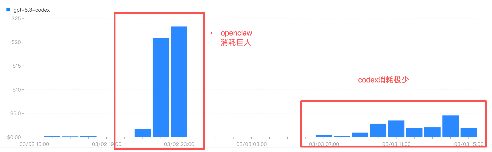

`Openclaw` 最近在社区里很火：

::github{repo="openclaw/openclaw"}

它提出了几个很有意思的方向：

- 对接 IM，让你可以在手机端远程操控本机环境
- 通过 `SOUL`、`IDENTITY`、`MEMORY` 与 `memory/*`，让模型具备个性化记忆
- 内置定时任务能力

不过，相比 `Codex` / `Claude Code` 这类代码 Agent，`Openclaw` 也有一些明显短板：

- 上下文缓存管理偏弱，同类调研任务通常会多消耗 5-10 倍 token
- 更新频繁且 bug 较多，作为个人项目在稳定性上还有差距
- 权限模型对普通用户门槛高，公网暴露接口后容易引入数据与财产安全风险



所以在实际使用中，我用 `Happy` 手机端 + `Codex` + `SMTP` 邮件通知，搭了一套自己的“小龙虾”工作流。

## Why

::github{repo="slopus/happy"}

`Happy` 可以让 `Codex` / `Claude Code` 在聊天界面里执行任务，界面友好；对中文用户来说，更关键的是**在中国大陆网络环境下可直接使用**。

它的限制是：主要面向 Git 文件浏览，日常自动化任务能力不足，也不支持直接互传文件。因此我用邮件通道补齐这部分能力。

::github{repo="openai/codex"}

`Codex` 的 token 成本很低。上图可以看到，同类调研任务消耗明显更少，做日常自动化非常划算。

至于 `Claude Code`，官方已提供 [远程操作](https://code.claude.com/docs/en/remote-control)。我没有选它，主要是账号稳定性对我当前场景不够友好。

## How

### Step 1：给“小龙虾”找个家

你需要一台常驻服务器。`Linux/macOS` 都可以，最好有 GUI，方便模型在必要时进行界面观察与操作。

我选择了 `AWS EC2`。新用户通常有一定额度（我当时是 `$100`），按配置不同大约可覆盖 3-6 个月的试用周期。

### Step 2：安装 Codex 和 Happy

```bash
# 安装 Codex
npm install -g @openai/codex

# 安装 Happy
npm install -g happy-coder
```

### Step 3：让 Codex 接管自动化

安装完成后，打开 `codex` 并让它执行这些任务：

- 拉取 `https://github.com/openclaw/openclaw/tree/main/docs/reference/templates` 下的 `md` 文件（排除 `.dev.md`），保存到本地目录；去掉前 6 行后，按 `BOOTSTRAP.md` 完成初始化

- 配置 SMTP relay，实现“可发邮件、无需收件”的通知链路；默认发送邮箱设为 `XXX@AAA.com`，并验证附件发送

- 用系统 `cron` 完成“定时触发 -> Codex 执行任务 -> 邮件通知”的闭环测试，并沉淀为可复用 skill

### Step 4：让 Happy 接管移动入口

你需要完成：

- 在 App Store 下载 `Happy Coder`
- 服务器执行 `happy codex`，打开 Happy 通道，并用手机扫码完成授权

再让 Codex 完成：

- 使用 `systemctl` 配置 `happy codex` 的开机自启与守护进程

### 完成

到这里，你就有了一只具备“小龙虾”能力的 Code Agent：核心更稳定、成本更可控、适配中文网络环境，并且可以通过邮件实现远程任务闭环。
